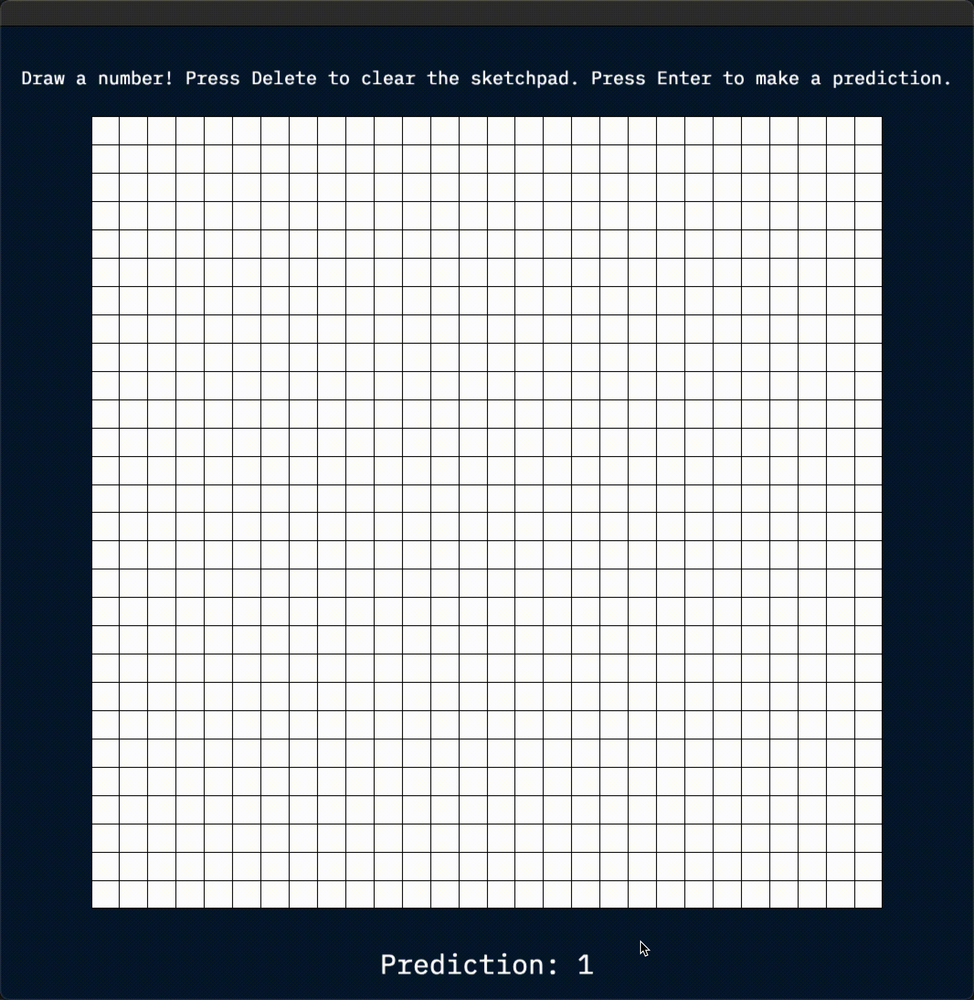

# Naive Bayes Classifier for MNIST Dataset

This repository contains a program that can read in a custom dataset of images and classify the numbers that are drawn on the screen with a mouse. 

It supports: 
- Multiple image sizes
- Training multiple models on different image sets
- Saving and loading model caches for comparison
- Unit testing of all main features
- Real-time classification

## Example


In the above GIF, the user draws the number by clicking, dragging, and releasing the mouse. They then press enter to generate the prediction at the bottom of the screen and delete to refresh the canvas. 

## Usage
CMake is required to build this program. The program provides three targets:
- `sketchpad-classifier`: Allows for the interactive classification of hand-drawn images through the GUI.
- `train-model`: Allows the user to control the training and saving of a model using a custom dataset.
- `naive-bayes-test`: Runs unit tests for the mathematical logic behind the Naive Bayes algorithm to ensure that the correct outputs are being generated. 

The `cache` folder contains some pre-trained models with which the classifier can be run. 

After cloning and building the program using CMakeLists.txt, you can use the following command line arguments to control the program's behavior through `train-model`: 
```
Allowed options:
  -h [ --help ]             Prints the descriptions for the command line 
                            arguments.
  -t [ --train ] arg        Trains the model. Takes two file paths,  first 
                            train images then train labels.
  -s [ --save ] arg         Saves the model. Takes one file path, the location 
                            for the model cache to be saved.
  -l [ --load ] arg         Loads the model from a given model cache file.
  -p [ --predict ] arg      Predicts the images at the given path and prints 
                            out predictions.
  -i [ --image-height ] arg Sets the height of each image in the training file.
```

This project was created for the class CS 126: Software Design Studio at the University of Illinois at Urbana-Champaign. If you have any questions, please email me at rustom [at] rustom.dev. 
